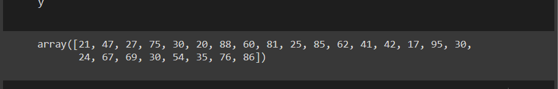
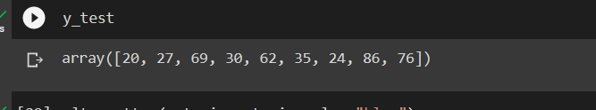
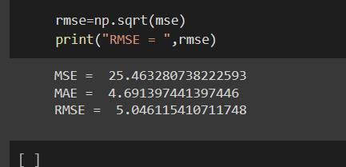

# Implementation-of-Simple-Linear-Regression-Model-for-Predicting-the-Marks-Scored

## AIM:
To write a program to predict the marks scored by a student using the simple linear regression model.

## Equipments Required:
1. Hardware – PCs
2. Anaconda – Python 3.7 Installation / Jupyter notebook

## Algorithm


  1. Import the required libraries and read the dataframe.

  2. Assign hours to X and scores to Y.

  3. Implement training set and test set of the dataframe

  4. Plot the required graph both for test data and training data.

   5. Find the values of MSE , MAE and RMSE.


## Program:
```
/*
Program to implement the simple linear regression model for predicting the marks scored.
Developed by: praveen s
RegisterNumber:  212222240077
*/
import pandas as pd
import  numpy  as np
import matplotlib.pyplot as plt
from sklearn.metrics import mean_absolute_error,mean_squared_error
df=pd.read_csv('student_scores.csv')
df.head()
df.tail()
x=df.iloc[:,:-1].values
x
y=df.iloc[:,1].values
y

from sklearn.model_selection import train_test_split
x_train,x_test,y_train,y_test=train_test_split(x,y,test_size=1/3,random_state=0)

from sklearn.linear_model import LinearRegression
regression =LinearRegression()
regression.fit(x_train,y_train)
y_pred=regression.predict(x_test)
y_pred
y_test
plt.scatter(x_train,y_train,color="blue")
plt.plot(x_train,regression.predict(x_train),color="red")
plt.title("Hours vs Scores (Training Set)")
plt.xlabel("Hours")
plt.ylabel("Scores")
plt.show()
plt.scatter(x_test,y_test,color='green')
plt.plot(x_test,regression.predict(x_test),color='purple')
plt.title(' Training set (Hours Vs Scores)')
plt.xlabel('Hours')
plt.ylabel('Scores')
mse=mean_squared_error(y_test,y_pred)

print('MSE = ',mse)

mae=mean_absolute_error(y_test,y_pred)
print('MAE = ',mae)

rmse=np.sqrt(mse)
print("RMSE = ",rmse)

```

## Output:
 df.head()
 

  
  
df.tail()


Array value of X


Array value of Y



Values of Y prediction


Array values of Y test



Training Set Graph


Test Set Graph


Values of MSE, MAE and RMSE




## Result:
Thus the program to implement the simple linear regression model for predicting the marks scored is written and verified using python programming.
